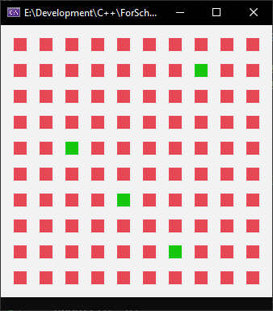

# Visualization of School Problem
## Marcel Zdziechowicz
---

### Program result


---
### CPP Code
```cpp
#include <cstdint>
#include <iostream>
#include <sstream>
#include <string_view>
#include <array>
#include <windows.h>

static constexpr std::string_view STRONG_WHITE  { "\033[107m" };
static constexpr std::string_view STRONG_GREEN  { "\033[102m" };
static constexpr std::string_view STRONG_RED    { "\033[101m" };
static constexpr std::string_view RESET         { "\033[0m" };

inline std::ostream& white(std::ostream& os) { return os << STRONG_WHITE;   }
inline std::ostream& green(std::ostream& os) { return os << STRONG_GREEN;   }
inline std::ostream& red(std::ostream& os)   { return os << STRONG_RED;     }
inline std::ostream& reset(std::ostream& os) { return os << RESET;          }

static constexpr uint32_t WIDTH     = 10;
static constexpr uint32_t HEIGHT    = 10;

static constexpr uint32_t CELL_WIDTH    = 2;
static constexpr uint32_t CELL_HEIGHT   = 1;

static constexpr uint32_t COLS = (2 * WIDTH + 1) * CELL_WIDTH;
static constexpr uint32_t ROWS = (2 * HEIGHT + 1) * CELL_HEIGHT;

static std::stringstream SCREEN;

static void SetWindowSize();
static void InitScreen();
static void Update(uint32_t Row, uint32_t Col);

int main()
{
    SetWindowSize();
    InitScreen();

    for (int x = 0; x < WIDTH; x++) {
        for (int y = 0; y < HEIGHT; y++) {
            Sleep(100);
            Update(x, y);
            system("cls");
            std::cout << SCREEN.str();
        }
    }

    system("pause > nul");
}

static void SetWindowSize()
{
    std::stringstream command;
    command << "mode con: cols=" << COLS << " lines=" << ROWS + 1;
    system(command.str().c_str());
}

static void InitScreen()
{
    std::string Frame(COLS, ' ');
    std::string Field(CELL_WIDTH, ' ');

    SCREEN.clear();
    for (int i = 0; i < ROWS; i++) {
        if (!(i % 2)) {
            SCREEN << white << Frame << '\n';
        }
        else {
            for (int j = 0; j < COLS / CELL_WIDTH; j++) {
                if (!(j % 2)) {
                    SCREEN << white << Field;
                }
                else {
                    SCREEN << red << Field;
                }
            }
            SCREEN << '\n';
        }
    }
    SCREEN << reset;
}

static void Update(uint32_t Row, uint32_t Col)
{
    uint32_t cs  = STRONG_WHITE.size();
    uint32_t eols= sizeof('\n');
    uint32_t fd  =  cs + CELL_WIDTH;
    uint32_t frw = cs + COLS + eols;
    uint32_t fdw = (COLS / CELL_WIDTH) * fd + eols;
    SCREEN.seekp(
        ((Row + 1) * frw) + (Row * fdw) + (((2 * Col) + 1) * fd), std::ios::beg).write(STRONG_GREEN.data(), STRONG_GREEN.size());
}
```